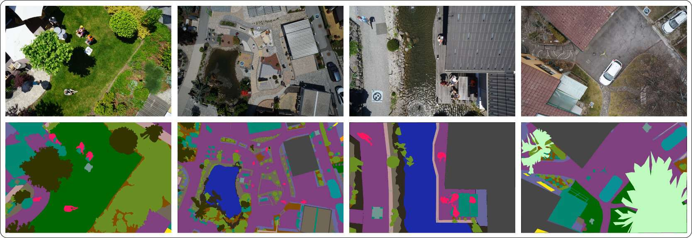

# Aerial Drone Imagery Segmentation with DINO and SegFormer

This repository compares **two semantic segmentation pipelines for aerial drone imagery** trained on the same resized dataset split:

1. **DINO + ResNet50 + U-Net decoder** 
2. **SegFormer-B3** 

The goal is to study how a **self-supervised CNN backbone with a custom decoder** compares against a **transformer-based segmentation model** on dense urban-scene understanding from bird's-eye-view images.

## What this repository does

The repo contains two end-to-end notebooks that:

- download the resized aerial segmentation dataset.
- build dataloaders and augmentations.
- train multiclass semantic segmentation models.
- evaluate performance with **mean IoU**.
- visualize predictions on the validation set.
- log training curves and intermediate validation predictions to **Weights & Biases**.

Both experiments target **24 semantic classes** from the Semantic Drone Dataset, including categories such as paved-area, dirt, grass, vegetation, roof, wall, person, car, bicycle, tree, obstacle, and more.

## Dataset

You can find more details about the training dataset [here](https://ivc.tugraz.at/research-project/semantic-drone-dataset/).

The experiments use a resized version of the **Semantic Drone Dataset** from TU Graz.

**Dataset split used in this repo:**

| Split | Samples |
| --- | ---: |
| Train | 340 |
| Validation | 60 |

**Image resolution used for training:**

- `384 x 576`

**Segmentation classes:**

`unlabeled, paved-area, dirt, grass, gravel, water, rocks, pool, vegetation, roof, wall, window, door, fence, fence-pole, person, dog, car, bicycle, tree, bald-tree, ar-marker, obstacle, conflicting`

## Architectures compared

### 1. DINO + ResNet50 + U-Net

- DINO self-supervised pretrained **ResNet50** encoder.
- custom **U-Net style decoder**.
- good fit when you want to reuse strong pretrained visual representations and retain a familiar encoder-decoder segmentation design.

Notebook: [Aerial_View_Segmentation_with_DINO.ipynb](https://github.com/sagar100rathod/aerial-drone-imagery-segmentation/blob/main/Aerial_View_Segmentation_with_DINO.ipynb)

### 2. SegFormer-B3

- Hugging Face model: `nvidia/segformer-b3-finetuned-ade-512-512`.
- transformer-based semantic segmentation architecture.
- lightweight decoding design with hierarchical transformer features.

Notebook: [Aerial_View_Segmentation_with_Segformer.ipynb](https://github.com/sagar100rathod/aerial-drone-imagery-segmentation/blob/main/Aerial_View_Segmentation_with_Segformer.ipynb)

## Experimental Setup

The two notebooks share most of the training recipe:

- **task:** multiclass semantic segmentation
- **epochs:** 50
- **optimizer:** AdamW
- **learning rate:** `3e-4`
- **weight decay:** `1e-4`
- **scheduler:** MultiStepLR
- **loss:** Dice + Cross Entropy
- **main evaluation metric:** mean IoU

**Important note:** the dataset, image size, optimization recipe, and evaluation metric are aligned across notebooks, but the **batch size differs**:

- DINO: batch size `2`
- SegFormer: batch size `12`

So this is a strong practical comparison, but not a perfectly controlled architecture-only ablation.

## Experiment Tracking

Both notebooks log experiments publicly to **Weights & Biases (W&B)**, including:

- training and validation metrics across epochs.
- loss and mean IoU curves.
- intermediate validation image visualizations during training.
- final tracked runs for reproducibility and comparison.

#### Public Project dashboard:

**W&B:** <https://wandb.ai/sagar100rathod/Aerial-Drone-Imagery-Segmentation>

## Results

### Validation metrics from notebook runs

| Model | Backbone / architecture | Params | Epochs | Batch size | Best val mIoU | Best val loss |
| --- | --- | ---: | ---: | ---: | ---: | ---: |
| DINO + U-Net | DINO-pretrained ResNet50 encoder + custom U-Net decoder | 43,874,648 | 50 | 2 | **0.8272** | 0.3859 |
| SegFormer-B3 | `nvidia/segformer-b3-finetuned-ade-512-512` | 47,240,920 | 50 | 12 | **0.8306** | **0.3804** |

### Relative Comparison

- **Best mIoU:** SegFormer-B3 is higher by **0.0035**.
- **Best validation loss:** SegFormer-B3 is lower by **0.0055**.
- **Parameter count:** DINO + U-Net is slightly smaller.

## Research takeaway

Both models perform strongly on the resized aerial dataset, with **validation mIoU above 0.82**. In these notebook runs:

- **SegFormer-B3** delivers the best overall validation score.
- **DINO + U-Net** remains highly competitive while using slightly fewer parameters.
- the gap is **small**, suggesting both architectures are viable for aerial semantic segmentation under this training setup.

## How to use

Open either notebook in Jupyter or Google Colab and run the cells sequentially.

- Use the **DINO notebook** to study a custom encoder-decoder pipeline based on self-supervised pretraining.
- Use the **SegFormer notebook** to study a transformer-based segmentation baseline using Hugging Face.

## Conclusion

This repository serves as a compact benchmark for **aerial image semantic segmentation**, showing that both **DINO-based** and **SegFormer-based** approaches achieve strong performance on the same dataset split, with **SegFormer-B3** holding a narrow edge in validation metrics in the current experiments.
